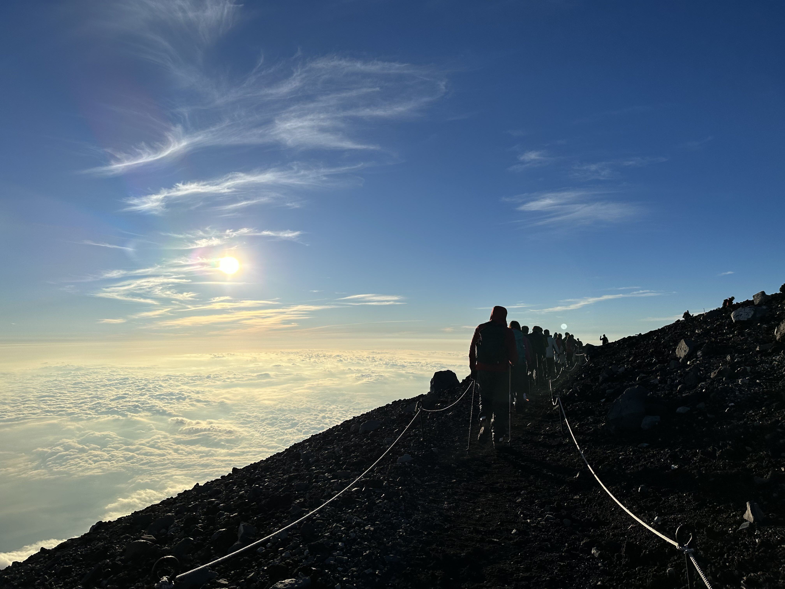
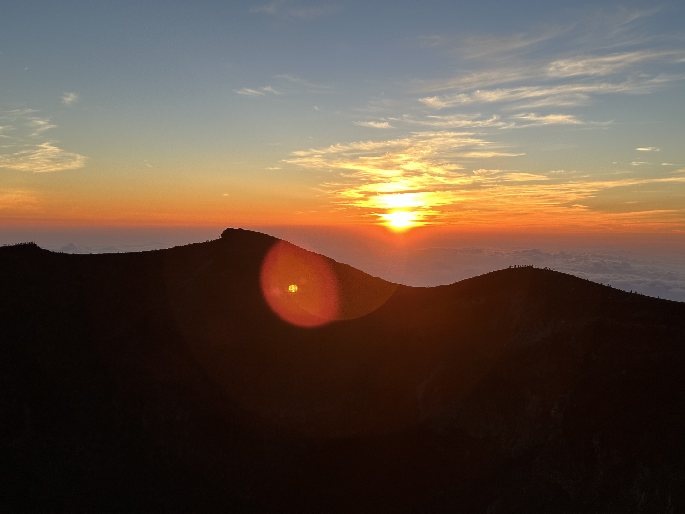
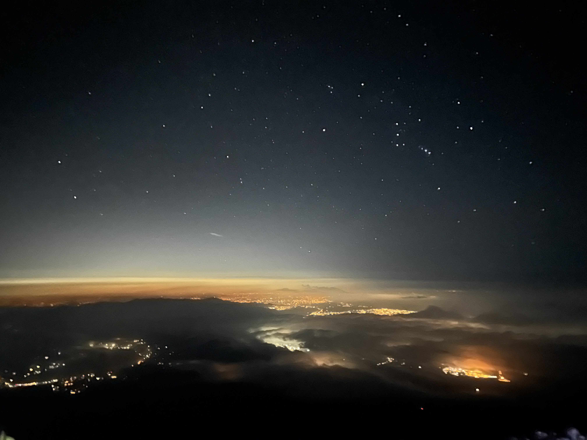
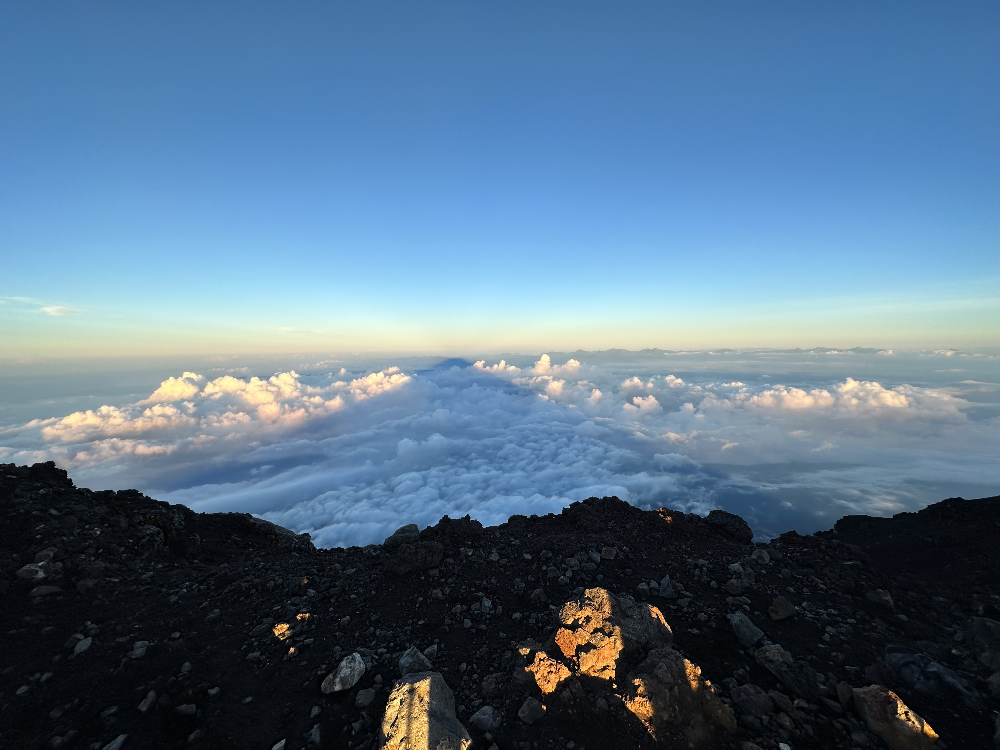
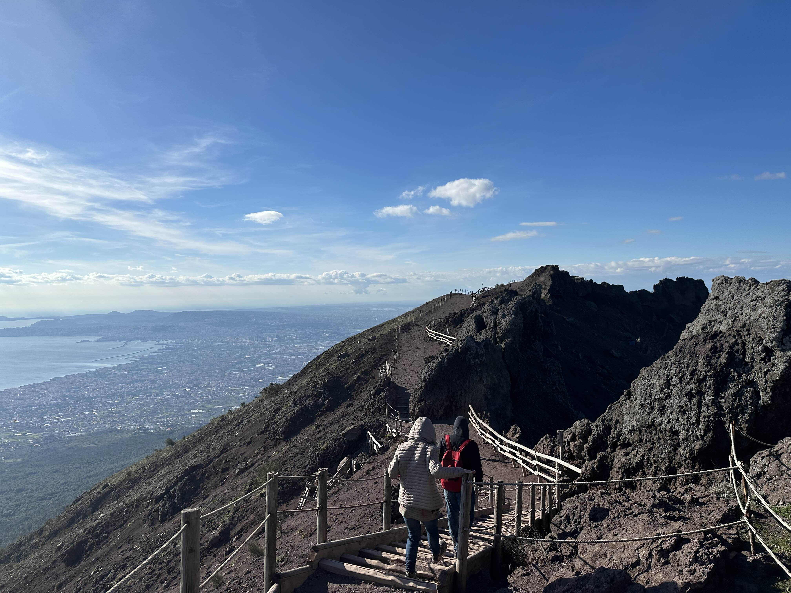
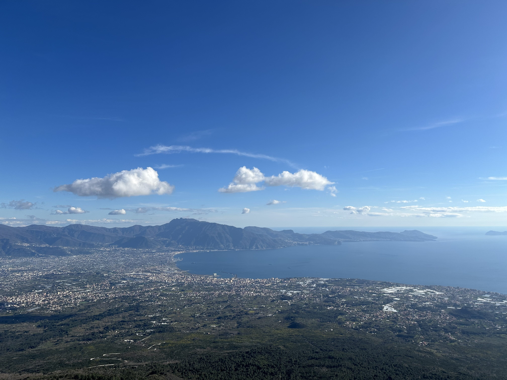
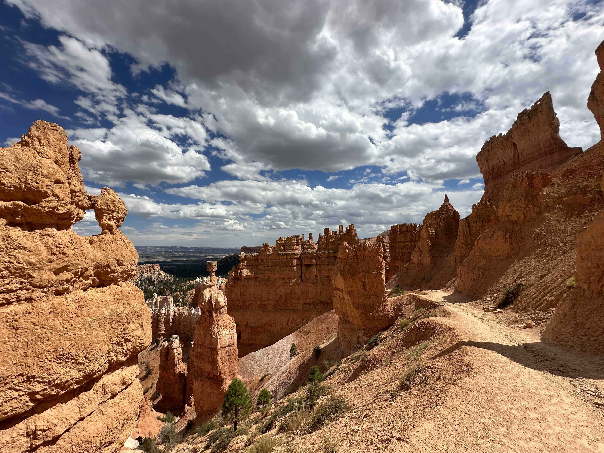
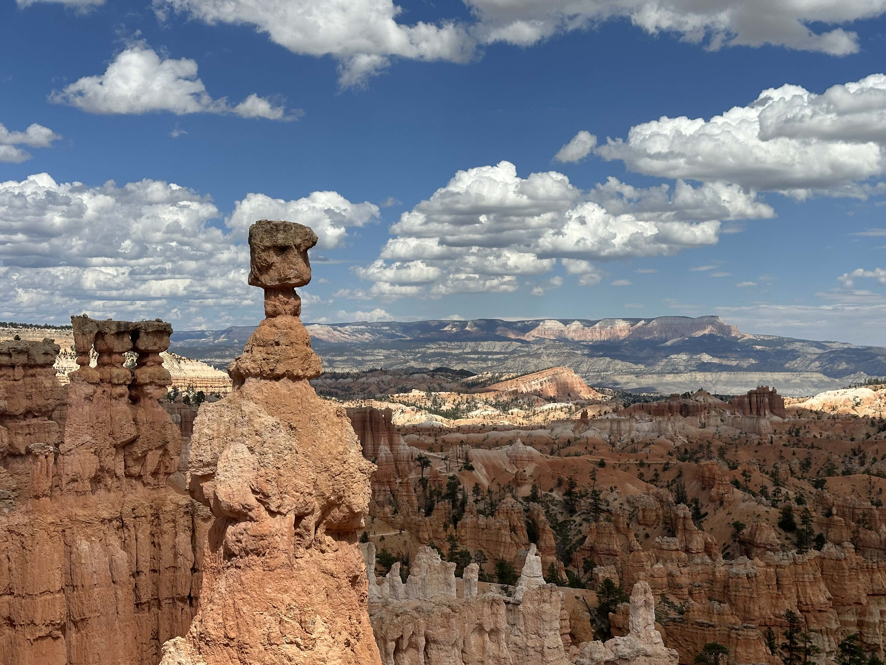
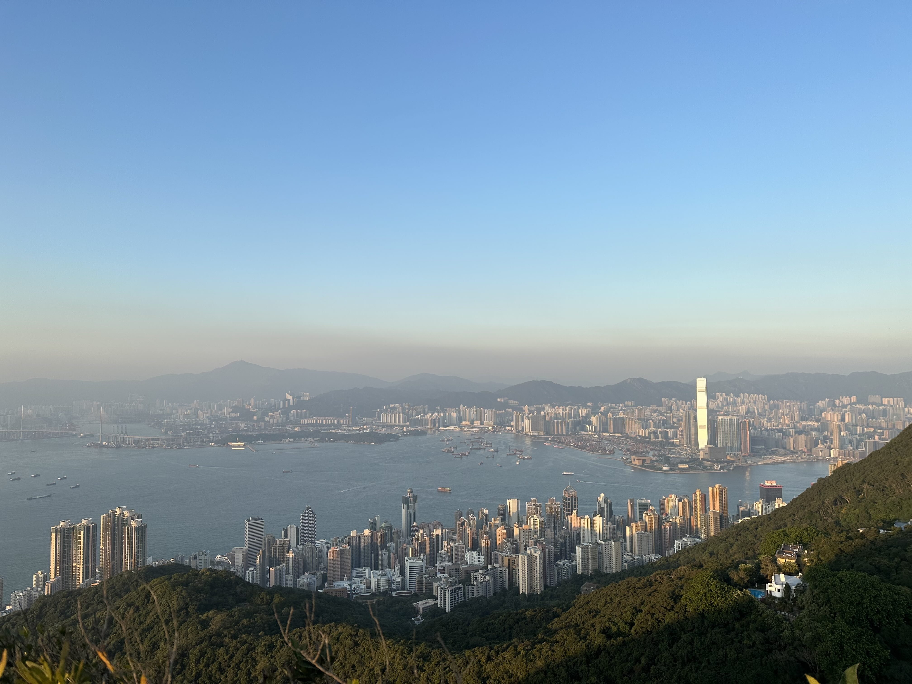
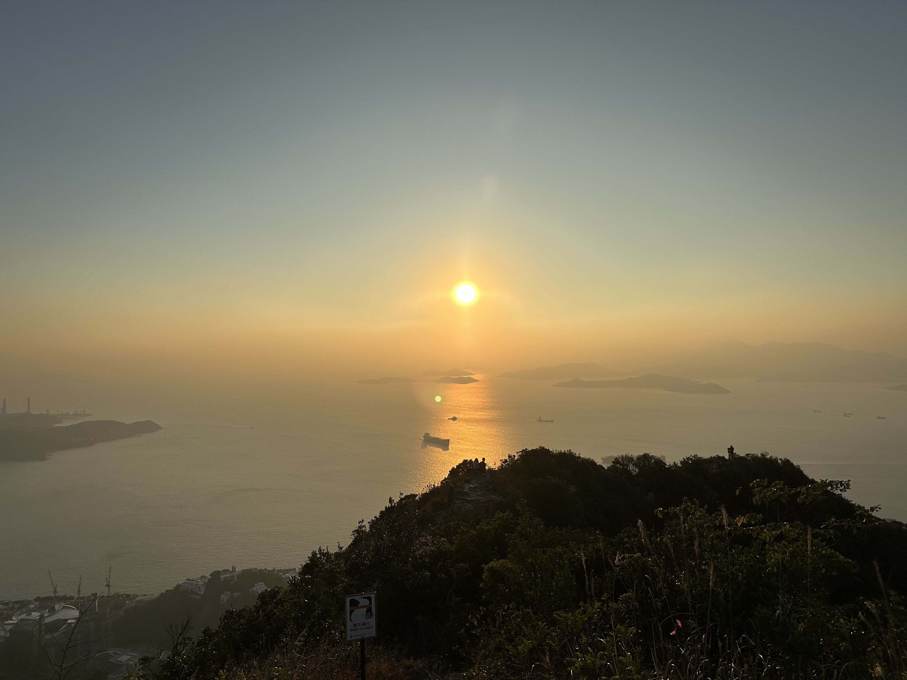

##### Mount Fuji, Japan

  
  

 

  
  

  

##### Mount Vesuvius, Italy

  
  

  

##### Bryce Canyon National Park, USA

  
  

  

##### Mount High West, Hong Kong

  
  

  

##### Some places on my list (please give me recs!)
- The Inca Trail, Peru
- Tre Cime di Lavaredo, Dolomites, Italy